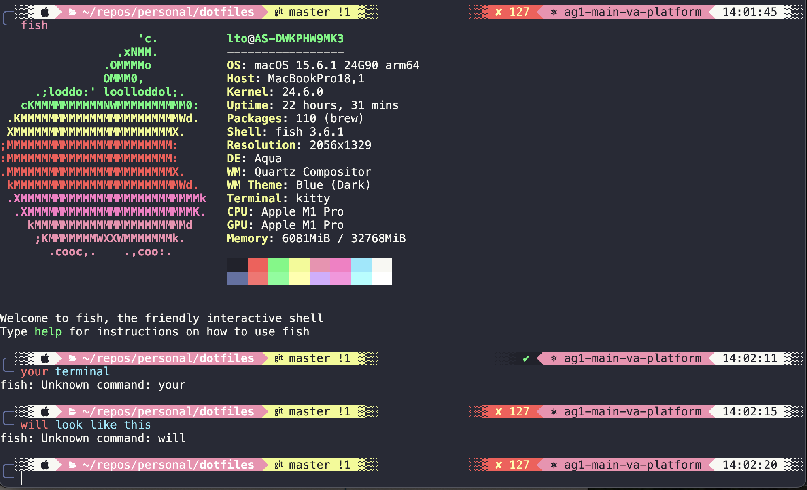

# macOS Dotfiles & Configuration Setup

This repository contains my personal dotfiles and configuration files for setting up a macOS development environment.

## Required Tools 
1. Homebrew
2. VSCode

## Overview 
1. **Fish Shell Setup** - install and configure Fish as the default shell
2. **Kitty Terminal** - the fast, feature-rich, cross-platform, GPU based terminal
3. **Fish Shell Configuration** - add plugins and customize Fish shell

## macOS Setup

### 1. Fish Shell Setup
1. Install Fish using Homebrew: `brew install fish`
2. Making Fish default shell
   
   2a. Add Fish to the list of valid shells
   
   macOS only allows certain shells to be set as defaults. Add Fish to /etc/shells:

   ```bash
   echo /opt/homebrew/bin/fish | sudo tee -a /etc/shells
   ```

   On Intel Macs, Fish may be at /usr/local/bin/fish instead of /opt/homebrew/bin/fish.

   You can check the Fish path with:

   ```bash
   which fish
   ```

   2b. Change your default shell to Fish

   ```bash
   chsh -s /opt/homebrew/bin/fish
   ```

   (Replace the path if yours is different.)

   2c. Restart the machine

   Restart your Mac to ensure the shell change is properly applied. After restart, open a new terminal and check:

   ```bash
   echo $SHELL
   ```

   It should show something like:

   ```
   /opt/homebrew/bin/fish
   ```

### 2. Kitty Terminal Setup
1. Install Kitty: https://sw.kovidgoyal.net/kitty/binary/
2. Copy configuration from https://github.com/m00nb0w/dotfiles/tree/master/macos/kitty to ~/.config/kitty 

### 3. Fish Shell Configuration
1. Install the manager plugins - fisher: https://github.com/jorgebucaran/fisher
2. Install mcfly - command history traversal: `brew install mcfly`

   Mcfly provides intelligent command history search with machine learning-powered suggestions.

3. Install neofetch - load icon at startup: `brew install neofetch`

   Neofetch displays system information with a custom ASCII art logo when you open a new terminal, creating a nice visual welcome screen.

4. Install direnv - per directory environment plugin: `brew install direnv`

   Direnv automatically loads and unloads environment variables based on the current directory, perfect for project-specific configurations.

5. Copy the config from https://github.com/m00nb0w/dotfiles/blob/master/macos/fish/config.fish to your fish config file
6. Install the styling for fish shell - Tide:

   Install [Tide](https://github.com/IlanCosman/tide) for a modern, fast, and customizable prompt:

   ```bash
   fisher install IlanCosman/tide@v5
   ```

   

   *Note: This shows the Tide prompt with neofetch output, git status (master branch with uncommitted changes), directory path (~/repos/personal/dotfiles), exit codes, and colorful segmented styling*

7. Loading the Fish config by copy everything under fish folder to your `.config/fish` - also note that this will be automatically sync, don't worry. After copying, run the `initial_setup.sh` script 
